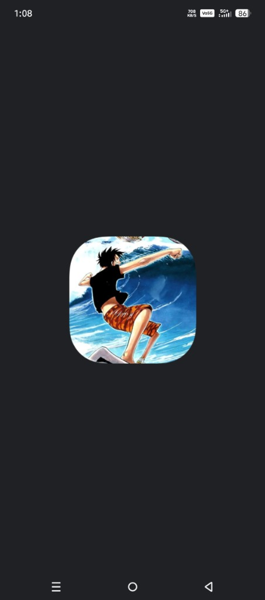
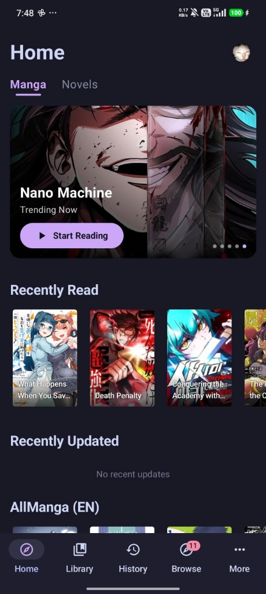
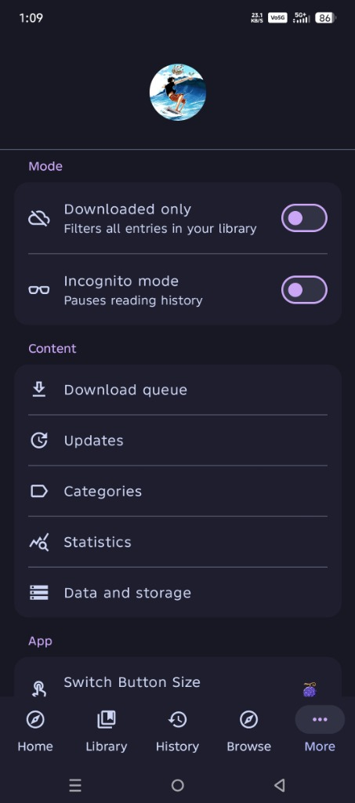
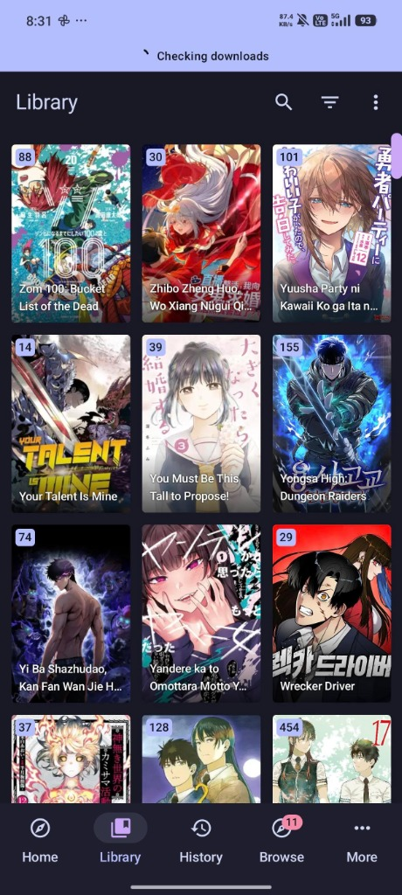

<p align="center">
  
</p>

<h1 align="center">Wammy</h1>

<p align="center">
  <b>The ultimate, open-source manga and novel reader for Android.</b>
</p>

<p align="center">
  <a href="https://kainotch.github.io/wammy-otaku.github.io/"><b>🌐 Official Website, Guides & Documentation</b></a>
</p>

<p align="center">
  <a href="https://github.com/kainotch/Wammy/releases"></a>
  <a href="https://github.com/kainotch/Wammy/blob/main/LICENSE"></a>
</p>

---

## What is Wammy?

Wammy is a powerful, unified reader application for Android that brings both your favorite **Manga** and **Light Novels** together into a single, beautifully designed interface. Whether you are catching up on the latest manhwa chapters or diving into a dense web novel, Wammy provides a seamless, lightning-fast, and completely customizable reading experience. 

Say goodbye to juggling multiple apps—everything is right here.

---

## 📸 Screenshots

| Splash Screen | Home & Library | Reader Settings | Dark Library |
|:---:|:---:|:---:|:---:|
|  |  |  |  |

---

## ✨ Features

### 📚 Unified Library (Manga + Novels)
Wammy completely merges the world of comics and text. Your library supports both manga and light novels side-by-side, complete with unread badges, custom categories, and powerful filtering.

### 🍎 The "Devil Fruit" Switcher
We built an exclusive, gesture-based navigation button to instantly switch between Manga and Novel modes. 
<br/>
 
**How it works:** See the Devil Fruit floating in the bottom corner of your screen? Simply press, hold, and **slide your finger up**. You'll feel a custom haptic vibration, and the app will instantly swap between your Manga catalogs and your Novel catalogs! No diving through menus required. 
<br clear="left"/>

### 🎨 Total Personalization
- **Customizable Buttons:** Is the Devil Fruit too big or too small? Head into **Settings > App > Switch Button Size** and use the slider to scale it perfectly to your thumb size! 
- **True Dark Theme:** Wammy enforces a gorgeous, pure dark mode by default, saving your OLED battery and your eyes.
- **Custom Profiles:** Upload your own profile picture directly to the app to make your home screen yours.

### 🌐 Extensions & Repositories
Wammy doesn't lock you into a single catalog. You can install extensions from various online repositories to browse, search, and read from thousands of sources across the internet. 

### ⚙️ Powerful Reader Tools
- **Offline Reading:** Queue up entire volumes to download and read on the go.
- **Tracking:** Automatically sync your reading progress with AniList, MyAnimeList, Kitsu, and more!
- **Text-to-Speech:** Listen to your favorite light novels with built-in TTS voice support.
- **Advanced Viewer:** Customize background colors, page margins, text sizes, and reading directions (Left-to-Right, Right-to-Left, Webtoon Strip, etc.).

---

## 🚀 Installation

1. Visit the [Official Download Page](https://kainotch.github.io/wammy-otaku.github.io/download.html) or the [Releases](https://github.com/kainotch/Wammy/releases) tab here on GitHub.
2. Download the latest `.apk` file.
3. If prompted, enable **"Install from Unknown Sources"** in your Android settings.
4. Install and enjoy!

---

## 🛠️ Building from Source

Want to contribute or build Wammy yourself?

### Prerequisites
- Android Studio (Latest Stable)
- JDK 17+
- Android SDK API level 35

### Steps
```bash
# Clone the repository
git clone https://github.com/kainotch/Wammy.git
cd Wammy

# Build the debug APK
./gradlew app:assembleDebug
```
The APK will be generated at `app/build/outputs/apk/debug/app-debug.apk`.

---

## 🤝 Credits & Support

- **Developer:** [@kainotch](https://github.com/kainotch)
- **Partner:** [@xo._kiwikaffine](https://instagram.com/xo._kiwikaffine)

If you love Wammy, be sure to check out the **[Official Website](https://kainotch.github.io/wammy-otaku.github.io/)** for full documentation, extension guides, and FAQs!

**License:** Apache License 2.0
